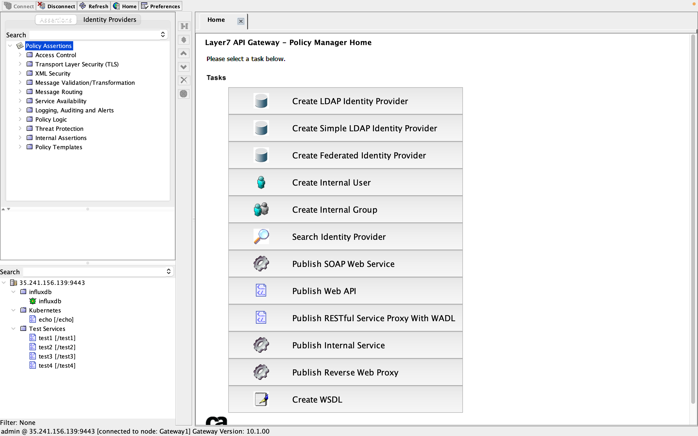

# About
This repository is a sample configuration to send service metrics data from an ephemeral container gateway (running on Kubernetes) to [InfluxDB](https://www.influxdata.com), and visualize the metrics in a [Grafana](https://grafana.com) dashboard.

# Getting Started
Before getting started, you must copy an API Gateway license file to the `./gateway/license` directory.

This example has been tested using Kubernetes 1.22. 

## Setup
You need to have a Kubernetes cluster up and running (4 cores and 16 GB RAM), as well as Kubectl and Helm deployed to your workstation. Make should also be installed on your workstation.
Once the cluster is up and running, ensure you can connect to it from your workstation and have the proper rights (cluster role binding to a cluster admin role may be required).

You can then deploy an ephemeral gateway by running the command 
`make install`

* First, a dedicated namespace "layer7" is created
* The Kubernetes cluster is customized using the kustomization.yaml file, with the addition of the "echo" and "offbox-test-services" bundles. Configmaps corresponding to the bundles are created. They are "mounted" into the ephemeral gateway at startup (see section "bundles" in the [value.yml](https://github.com/CAAPIM/apim-charts/blob/stable/charts/gateway/values.yaml) file). The "echo" bundle corresponds to an "echo" service whilst the "offbox-test-services" includes 4 test services.
* Finally, the ephemeral gateway is started, with custom values specified in [myvalue.yml](./helm/myvalues.yaml). The bundles are loaded from the configmaps. Service metrics as well as InfluxDb to collect the metrics and Grafana to visualize them are all enabled.

Once started, the following services are available from your Kubernetes cluster:

| Service Name | Description |
| --------|---------|
| ssg-gateway | Container gateway. Port 8443 is bind to the host, with an external IP, where API requests are sent. |
| ssg-gateway-management | Port 9443 is bind to this external IP and used to connect into the container gateway with the Policy Manager. |
| influxdb | InfluxDB. Port 8086 is bind to the host. Does not have an external IP. |
| grafana | Grafana. Port 3000 is bind to this host. Connected to with port-forwarding. |

When connecting to the gateway with a Policy Manager, one can observe that there are 4 test services created in the "Test" repository. Test1 is routing to the "echo" service. The other three test services are generating different errors that are visualized with Grafana.

## Login to Grafana
Port forwarding must ben enabled, using the command `make grafana`.

Open a web browser and go to http://localhost:3000. Login using the default administrator credentials ("admin"/"password") configured in [values.yml](https://github.com/CAAPIM/apim-charts/blob/stable/charts/gateway/values.yaml). 

## Sending traffic to the Gateway
To send traffic to the Gateway, first get the external IP of the ssg-gateway service (`kubectl get svc -n layer7`). Then run the following script:

`./send_api_requests.sh <ssg-gateway external IP>`

This script will randomly send request to the following services on the Gateway.

| Service name | Description |
| --------|--------- |
| test1 [/test1] | This service successfully sends request to the downstream "echo" service. |
| test2 [/test2] | This service fails with policy violation. |
| test3 [/test3] | This service fails with routing failure. |
| test4 [/test4] | This service runs successfully but does not send request to a downstream service. |

## Viewing Gateway service metrics dashboard
Go back to the Grafana - Home page in the web browser. Click on the dashboard dropdown button next to the 'Home' label near the top of the page. Click on the *Gateway Service Metrics* link to view the service metrics dashboard.

You should see data in the dashboard.

**Tip**: If you don't see any data, go back to the Grafana - Home page and click on the *Gateway Service Metrics* link again.

To stop sending traffic to the Gateway, press `Ctrl + C`

## Uninstall the gateway
Run the following command:

`make uninstall`

# Enabling Off-Boxing on an existing gateway
To enable the metrics off-boxing on a target gateway, you can load the bundle avaible , making a REST call to the target gateway: 
`curl -kv -u <login:password> -H "Content-Type: application/xml" -X PUT https://<target_gateway>:8443/restman/1.0/bundle -d@"./gateway/bundles/influxdb.bundle"`

Once loaded, the service is available as shown below:

See also the  to finalize the configuration.

# Giving Back
## How You Can Contribute
Contributions are welcome and much appreciated. To learn more, see the [Contribution Guidelines][contributing].

## License

Copyright (c) 2018 CA. All rights reserved.

This software may be modified and distributed under the terms
of the MIT license. See the [LICENSE][license-link] file for details.

 [license-link]: /LICENSE
 [contributing]: /CONTRIBUTING.md
